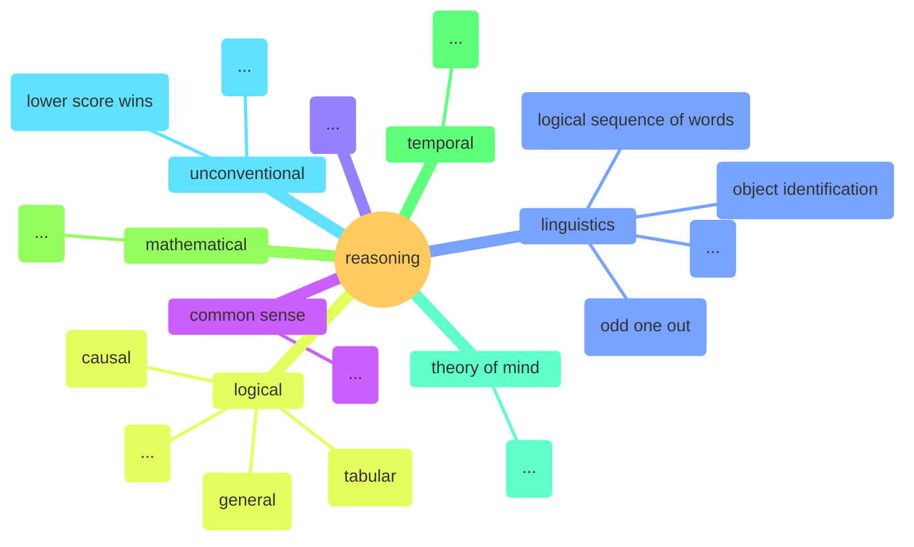
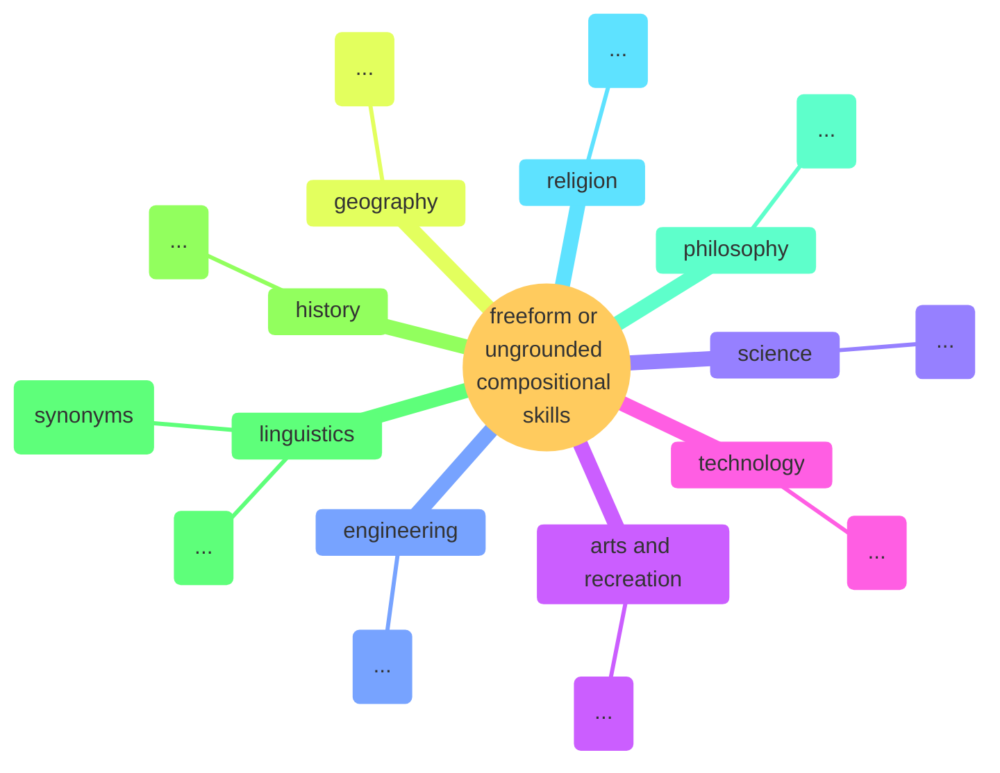
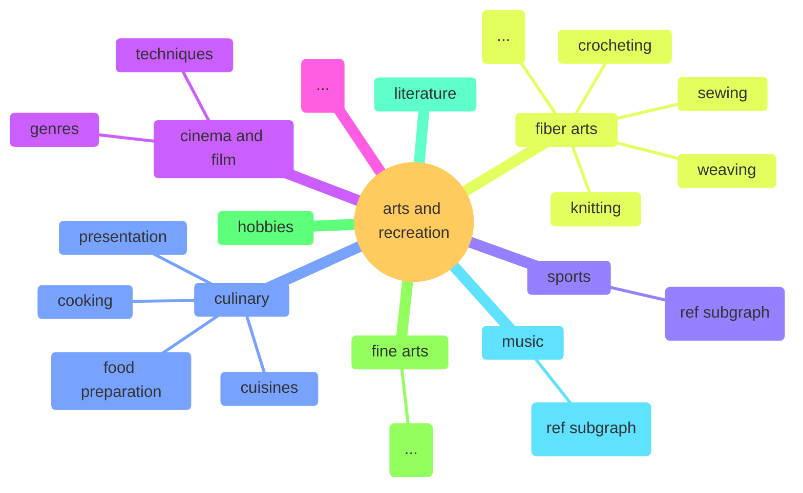

## Root

This is the basic structure of our taxonomy.

## Foundational or Core Skills

Note that the InstructLab project is not accepting submissions for foundational skills at this time.

To learn more, reference [the docs on core skills](https://docs.instructlab.ai/taxonomy/skills/skills_guide/#core-skills).

Currently, the only foundational skill tree is reasoning.

## Compositional Skills

* [Overall](#overall-skills)
* [Grounded](#grounded)
* [Freeform](#freeform)

### Overall Skills

### Grounded

To learn about what grounded skills are, reference [the docs on grounded compositional skills](https://docs.instructlab.ai/taxonomy/skills/skills_guide/#grounded-compositional-skills).

### Freeform

To learn about what freeform or ungrounded compositional skills are, reference [the docs on freeform compositional skills](https://docs.instructlab.ai/taxonomy/skills/skills_guide/#freeform-compositional-skills).

## Knowledge

* [Overall](#overall-knowledge)
* [Arts and Recreation](#arts-and-recreation)
* [Engineering](#engineering)
* [Geography](#geography)
* [History](#history)
* [Linguistics](#linguistics)
* [Mathematics](#mathematics)
* [Philosophy](#philosophy)
* [Religion](#religion)
* [Science](#science)
* [Technology](#technology)

### Overall Knowledge

### Arts and Recreation

#### Music

#### Sports

### Engineering

### Geography

### History

### Linguistics

### Mathematics

### Philosophy

### Religion

### Science

### Technology
