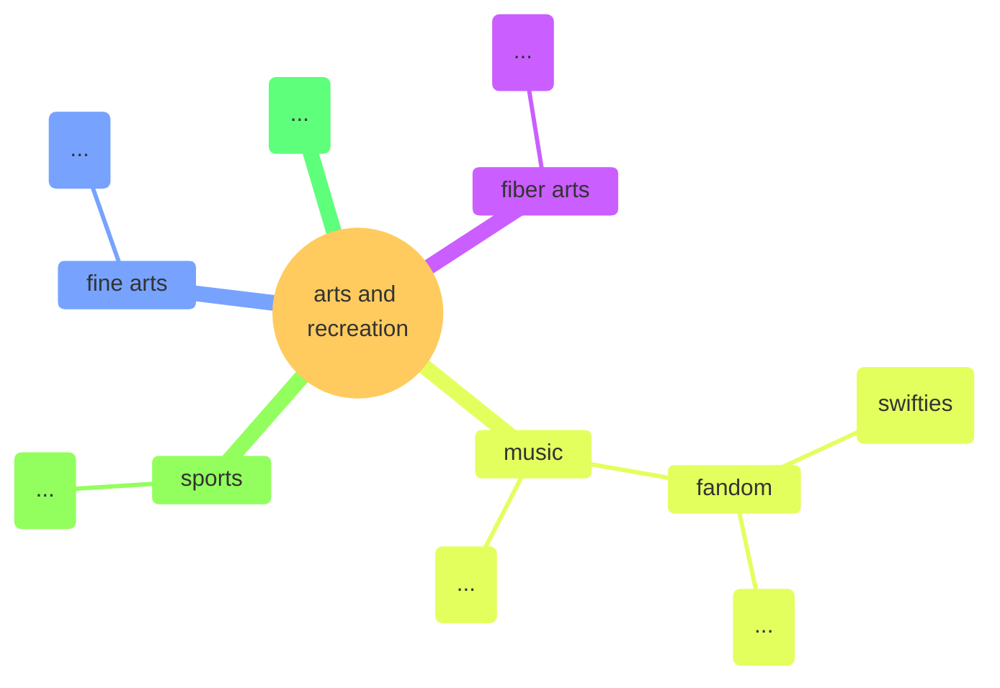
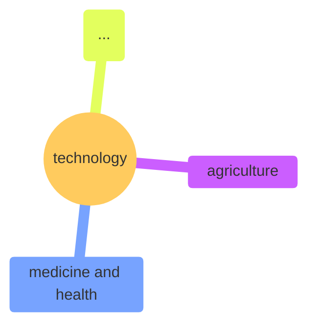

## Root

This is the basic structure of our taxonomy.

## Foundational Skills

Note that the InstructLab project is not accepting submissions for foundational skills at this time.

## Compositional Skills

## Knowledge

* [Overall](#overall)
* [Arts and Recreation](#arts-and-recreation)
* [Engineering](#engineering)
* [Geography](#geography)
* [History](#history)
* [Linguistics](#linguistics)
* [Mathematics](#mathematics)
* [Philosophy](#philosophy)
* [Religion](#religion)
* [Science](#science)
* [Technology](#technology)

### Overall

### Arts and Recreation

### Engineering

### Geography
### History
### Linguistics
### Mathematics
### Philosophy
### Religion
### Science

### Technology
